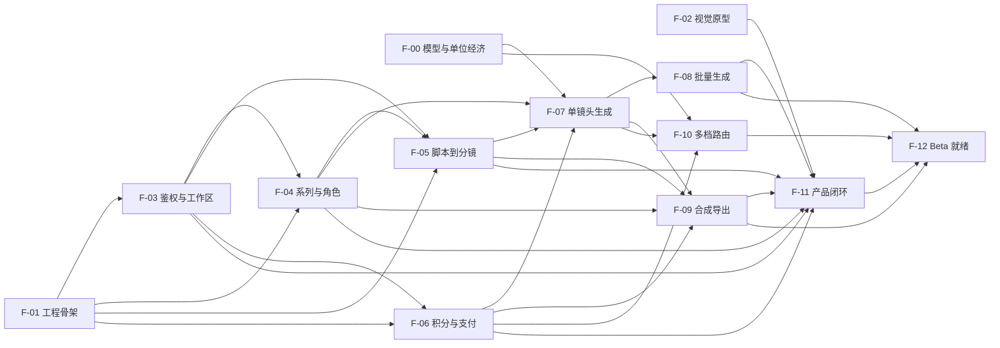

# PlotPop MVP 实施计划

## 1. 计划目标

本计划用于将《AI 漫剧 SaaS 产品与技术设计规格》落地为可验证的 MVP。实施顺序优先处理三类高风险：

1. 角色一致性与 5–10 分钟长内容的生成质量。
2. 单位成片分钟成本与积分计费正确性。
3. 多供应商异步任务、回调、重试和媒体合成的可靠性。

在以上风险得到真实数据验证前，不投入大规模页面开发，也不开放无限时长、重试或并发。

## 2. 技术基线

- Monorepo：pnpm Workspace + Turborepo。
- Web：Next.js + TypeScript。
- API：Hono + `@hono/node-server`。
- Worker：Node.js + BullMQ。
- 鉴权：Better Auth。
- 数据库：PostgreSQL + Drizzle ORM。
- 契约：Zod + OpenAPI。
- 队列：Redis + BullMQ。
- 媒体：FFmpeg + FFprobe。
- 文件：S3 兼容对象存储。
- 容器：Docker + Docker Compose。
- 测试：Vitest、Testing Library、Playwright。
- 代码质量：ESLint、Prettier、TypeScript 严格模式。
- 可观测性：OpenTelemetry、结构化日志和错误追踪。

具体托管供应商在基础设施阶段通过短期验证确定，领域代码不得依赖厂商 SDK 以外的专有能力。

## 3. 目标仓库结构

```text
PlotPop/
  apps/
    web/
    api/
    worker/
  packages/
    auth/
    config/
    contracts/
    db/
    domain/
    observability/
    providers/
    testkit/
    ui/
  docs/
    ai-comic-drama-saas-design.md
    implementation-plan.md
    adr/
    runbooks/
  tooling/
    eslint/
    typescript/
  docker/
    api.Dockerfile
    worker.Dockerfile
    compose.yaml
  turbo.json
  pnpm-workspace.yaml
  package.json
```

## 4. 交付策略

每个阶段必须满足以下条件才能进入下一阶段：

- 类型检查、Lint 和相关测试通过。
- 数据库变更有迁移、回滚或前滚说明。
- 新增状态或任务有失败与恢复路径。
- 新增付费操作有积分不变量测试。
- 新增外部服务有本地替身或契约测试。
- 文档和环境变量示例同步更新。

实现采用小批次提交。每个提交只包含一个可描述、可验证的增量。

### 4.1 执行方式

实际开发不按数据库、API、Worker、Web 等技术层串行推进，而按“可独立演示、可独立测试的用户价值”进行垂直切片。

每个垂直切片必须包含其所需的：

- 数据库迁移与查询。
- 领域规则。
- API 契约和权限。
- Worker 或外部服务集成。
- Web 界面和错误状态。
- 自动化测试。
- 日志、指标和运维说明。

后续第 5–16 节是技术能力检查清单，不代表严格执行顺序。实际执行顺序以第 4.2–4.5 节的任务依赖图为准。

### 4.2 垂直任务清单

#### F-00：模型质量与单位经济验证

**用户价值：**确认 PlotPop 是否能以可接受成本生成可连载镜头。

**范围：**

- 固定角色、场景和 20–30 个镜头测试集。
- 第一家视频供应商实验适配器。
- 生成输入、输出、耗时、计费和错误记录。
- 角色一致性人工评分。
- Draft、Standard、Pro 初始边界。

**依赖：**无。

**可并行：**可与 F-01、F-02 同时开始。

**完成产物：**供应商评估、单位经济报告、MVP 风格与镜头限制。

#### F-01：可运行工程骨架

**用户价值：**团队可以在一致环境中运行 Web、API 和 Worker。

**范围：**

- pnpm Workspace、Turborepo 和共享配置。
- Next.js、Hono、Worker 最小应用。
- Dockerfile 与 Docker Compose。
- PostgreSQL、Redis 和 S3 兼容本地服务。
- TypeScript、Lint、测试和 CI。
- 健康检查和最小结构化日志。

**依赖：**无。

**可并行：**可与 F-00、F-02 同时开始。

**完成产物：**一条命令启动完整本地环境，CI 构建三个应用和两个容器镜像。

#### F-02：视觉系统与交互原型

**用户价值：**目标创作者可以验证 Pop Anime 视觉语言和主创作流程。

**范围：**

- 设计 Token、字体、颜色、描边、投影和状态语义。
- Creator Home、五步向导和 Episode Studio 静态交互原型。
- 桌面与小屏审阅布局。
- 键盘焦点和基础无障碍规则。
- 英文本地化资源骨架。

**依赖：**无。

**可并行：**可与 F-00、F-01 同时开始。

**完成产物：**可点击原型与组件视觉验收记录；不连接真实业务 API。

#### F-03：注册、登录与默认工作区

**用户价值：**新用户能够注册、登录并进入自己的私有创作空间。

**范围：**

- Better Auth Schema、迁移与 Hono Handler。
- 邮箱密码、邮箱验证和账户恢复。
- 注册后幂等创建 Workspace 与 Credit Account。
- Session 中间件和 Workspace 隔离。
- Web 登录、注册、验证和错误页面。
- 同源 API Rewrite。
- 鉴权集成测试与跨 Workspace 测试。

**依赖：**F-01。

**可并行：**F-04 在 F-01 完成后可同时开发，但合并前必须使用 F-03 的 Workspace 契约。

**完成产物：**用户可登录并访问只属于自己的空 Creator Home。

#### F-04：系列、角色与参考素材

**用户价值：**用户能够创建系列、定义角色并上传可复用参考图。

**范围：**

- Series、Character、Character Version、Asset Schema。
- Series 与角色领域规则和版本规则。
- Hono CRUD、Revision 冲突和 Workspace 权限。
- 签名上传、上传确认与 Media Worker 文件验证。
- Series 与角色 Web 页面。
- 对象存储、权限、格式和重复确认测试。

**依赖：**F-01；合并到主线前依赖 F-03。

**可并行：**可与 F-03、F-05 的领域建模并行。

**完成产物：**登录用户可以创建系列、角色和经过验证的私有参考素材。

#### F-05：剧集脚本到可编辑分镜

**用户价值：**用户可以提交脚本，得到可审阅、可修改的场景与镜头表。

**范围：**

- Episode、Scene、Shot、Shot Version Schema。
- 脚本结构化契约与 Fake Provider。
- 任务状态、Generation Run、Task 和 Outbox 最小实现。
- 脚本分析 Worker 与进度事件。
- 剧集向导前三步：Script、Cast、Storyboard。
- 场景和镜头增删、拆分、合并和排序。
- SSE 与轮询兜底。
- 刷新恢复、重复提交和单任务失败测试。

**依赖：**F-01、F-03；角色匹配完整体验依赖 F-04。

**可并行：**F-04 进行时可先用固定角色契约开发；与 F-06 的积分领域测试并行。

**完成产物：**用户能从脚本生成并批准结构化分镜，不产生付费视频。

#### F-06：积分购买、预留与消费明细

**用户价值：**用户可以购买积分，并在任何付费生成前看到预估和余额变化。

**范围：**

- Credit Account、Ledger 和不变量。
- Estimate、Reserve、Settle、Release、Refund。
- Stripe Checkout 与 Webhook 去重。
- 积分包、余额和消费明细页面。
- 支付失败、重复回调、并发预留和补偿测试。
- 账本一致性 Reconciler。

**依赖：**F-01、F-03。

**可并行：**可与 F-04、F-05 同时开发。

**完成产物：**测试支付能够安全增加积分；Fake Generation 能完成预留与结算。

#### F-07：单镜头视频生成闭环

**用户价值：**用户可以选择一个分镜，生成、预览、重试并批准视频镜头。

**范围：**

- Provider Adapter 统一接口。
- Draft 档真实供应商接入和 Fake Provider。
- Provider Callback 验签、去重和乱序处理。
- BullMQ AI Worker、重试、取消和状态查询。
- 镜头候选版本与 Asset 关联。
- Episode Studio 的单镜头生成和版本选择。
- 积分预估、预留、结算与失败释放。
- 超时、重复回调、Worker 中断和价格超限测试。

**依赖：**F-00、F-04、F-05、F-06。

**可并行：**F-08 可在 F-07 的适配器契约稳定后开发；F-09 可先用假视频资产开发。

**完成产物：**真实用户能够安全付费生成一个镜头并选择批准版本。

#### F-08：批量剧集生成与任务恢复

**用户价值：**用户可以批量生成一集的多个镜头，离开页面后任务继续运行，局部失败可恢复。

**范围：**

- 持久化剧集任务图。
- 按 Workspace 和供应商限制并发。
- 多镜头视频和配音任务。
- 取消、局部重试和 Needs Review。
- Redis 队列重建与卡住任务 Reconciler。
- Episode Studio 场景状态、总进度和集中错误处理。
- 队列丢失、供应商超时和部分成功故障测试。

**依赖：**F-07。

**可并行：**可与 F-09、F-10 同时开发。

**完成产物：**测试剧集可以跨页面关闭、API 发布和 Worker 重启持续生成。

#### F-09：Animatic 与最终合成导出

**用户价值：**用户可以先审阅低成本 Animatic，再导出完整横版或竖版成片。

**范围：**

- Animatic 生成和审阅。
- Media Worker、FFprobe 输入验证和 FFmpeg 分段合成。
- 配音、字幕、音乐和时间线数据。
- Export Schema、状态和历史。
- 1080p、16:9、9:16、内嵌字幕、纯净版和字幕文件。
- 合成积分、签名下载和保留周期。
- 合成失败、局部重试、临时磁盘和孤立文件测试。

**依赖：**F-04、F-05、F-06；真实镜头集成依赖 F-07。

**可并行：**F-07 期间使用固定测试资产开发；与 F-08、F-10 并行。

**完成产物：**固定资产和真实生成资产均可生成可下载成片。

#### F-10：多档模型路由与成本保护

**用户价值：**用户可以按 Draft、Standard、Pro 选择质量，并获得稳定的成本上限。

**范围：**

- 第二家供应商或明确降级路径。
- Provider Router 能力、健康、区域与价格策略。
- 用户确认的最高费用和超限暂停。
- 供应商质量、成功率和单位成本指标。
- 管理配置和安全回滚。
- 降级、限流、涨价和供应商故障测试。

**依赖：**F-00、F-06、F-07。

**可并行：**可与 F-08、F-09 同时开发。

**完成产物：**质量档位与供应商解耦，降级不会突破用户确认成本。

#### F-11：完整创作者产品闭环

**用户价值：**新用户可以从官网进入产品，完成首集并查看全部消费和导出记录。

**范围：**

- Creator Home 状态与恢复入口。
- 五步向导完整连接。
- Episode Studio 三栏工作台。
- 积分购买、消费明细、进度、审阅和导出整合。
- 官网、案例页和积分页。
- 账户、隐私和删除。
- 英文本地化、响应式与无障碍完善。
- 注册到导出的 Playwright E2E。

**依赖：**F-02、F-03、F-04、F-05、F-06、F-08、F-09。

**可并行：**页面可在依赖任务提供稳定契约后分模块并行，最终集成串行完成。

**完成产物：**目标用户不借助内部工具即可完成注册、购买、创作、修复和导出。

#### F-12：Beta 可靠性、安全与运营

**用户价值：**受邀用户能够在可监控、可恢复、可支持的环境中安全使用产品。

**范围：**

- OpenTelemetry 全链路追踪和关键指标。
- 告警、Runbook、成本仪表盘和供应商健康。
- 权限矩阵、速率限制、内容审核和版权确认。
- 数据删除、资产保留和审计记录。
- 数据库恢复、队列重建和 Worker 滚动升级演练。
- 镜像扫描、生产 Secret 和环境隔离。
- 故障注入、负载、安全和可访问性测试。

**依赖：**F-08、F-09、F-10、F-11。

**可并行：**可观测性和安全基线从 F-01 起持续实施；最终 Beta 验收依赖完整闭环。

**完成产物：**达到邀请制 Beta 发布门槛。

### 4.3 依赖关系



### 4.4 并行执行波次

| 波次 | 可并行任务 | 汇合条件 |
|---|---|---|
| W0 | F-00、F-01、F-02 | 工程骨架可运行；质量与成本方向没有否决产品 |
| W1 | F-03、F-04 基础建模、F-05 领域建模 | Better Auth 的 User/Workspace 契约稳定 |
| W2 | F-04 完整实现、F-05、F-06 | 角色、分镜和积分 API 契约稳定 |
| W3 | F-07、F-09 的固定资产路径 | 单镜头适配器契约与 Asset 契约稳定 |
| W4 | F-08、F-09 真实资产集成、F-10 | 单镜头生成、积分结算和回调可靠 |
| W5 | F-11 分页面并行、F-12 运维与安全加固 | 完整 E2E 可运行 |
| W6 | F-12 最终验收 | Beta 发布门槛全部通过 |

同一波次内可以由不同开发者或 Agent 并行执行，但必须遵循以下规则：

- 每项任务使用独立分支或 Worktree。
- 共享契约先合并，再并行实现消费者。
- 数据库迁移按编号串行合并，不允许两个任务修改同一迁移文件。
- 不共享未提交工作区。
- 每个任务合并前更新主分支并运行受影响的集成测试。
- 并行任务只能依赖已合并契约，不依赖另一个分支中的临时代码。

### 4.5 关键路径

MVP 的关键路径为：

**F-01 → F-03 → F-04 → F-05 → F-07 → F-08 → F-11 → F-12**

其中 F-00 是产品继续投入的前置门槛，虽然可与 F-01 并行，但必须在 F-07 接入真实付费生成前通过。

F-06 是所有付费生成的硬依赖。F-09 可以使用固定测试资产提前并行，但真实成片验收必须等待 F-07。F-10 不阻塞单供应商 MVP 演示，但阻塞受控 Beta。

## 5. 阶段 0：风险验证原型

### 5.1 目标

在搭建完整产品前，用最小脚本验证模型质量、角色一致性、生成耗时与真实成本。

### 5.2 工作项

- 定义 1 个测试系列、2–4 个固定角色、3 个固定场景。
- 准备覆盖近景、远景、对话、动作和多人镜头的 20–30 镜头测试集。
- 定义 Draft、Standard、Pro 三档期望。
- 为第一家视频供应商实现一次性实验适配器。
- 保存每次生成的输入、输出、耗时、计费单位、重试次数和失败类型。
- 用 FFprobe 收集输出分辨率、帧率、编码和时长。
- 建立人工评分表：角色身份、服装、画风、场景连续性、动作可用性和可发布性。
- 计算每镜头与每成片分钟的 P50、P95 成本和耗时。
- 记录供应商审核、限流和失败行为。

### 5.3 产物

- `docs/research/provider-evaluation.md`
- `docs/research/unit-economics.md`
- 可重复执行的实验脚本。
- 脱敏后的测试结果数据。

### 5.4 完成标准

- 已有真实数据支持三档质量和积分定价草案。
- 已明确推荐镜头时长、角色上限和可支持风格。
- 已判断角色一致性是否足以进入 MVP。
- 若不满足，先调整产品约束或生成工作流，不进入完整功能开发。

## 6. 阶段 1：Monorepo 与工程基线

### 6.1 工作项

- 初始化 pnpm Workspace 和 Turborepo。
- 创建 `apps/web`、`apps/api`、`apps/worker`。
- 创建共享包和 TypeScript Project References。
- 启用 TypeScript 严格模式。
- 配置统一 ESLint、Prettier 和导入边界规则。
- 配置 Vitest 与测试覆盖率输出。
- 添加 `.editorconfig`、`.gitignore`、`.env.example`。
- 添加统一脚本：`dev`、`build`、`typecheck`、`lint`、`test`、`test:e2e`。
- 配置 CI：安装、类型检查、Lint、单元测试和构建。
- 为 API 和 Worker 编写多阶段 Dockerfile。
- 使用非 Root 用户运行生产容器。
- 使用 Docker Compose 编排本地 PostgreSQL、Redis、S3 兼容存储、API 和 Worker。
- 添加容器健康检查、资源限制、持久化卷和独立网络。
- 配置 `.dockerignore`，避免缓存、密钥和本地数据进入构建上下文。
- 在 CI 中构建 API 与 Worker 镜像，并执行启动和健康检查。

### 6.2 完成标准

- 新环境可以通过一条文档化命令启动依赖。
- 三个应用可以独立开发和构建。
- Docker Compose 可以启动完整本地依赖与服务。
- API 和 Worker 镜像可以独立构建、运行并通过健康检查。
- 生产镜像不包含开发依赖、源码缓存或明文密钥。
- CI 在空功能骨架上全部通过。
- 包之间不存在循环依赖。

## 7. 阶段 2：领域模型与数据库

### 7.1 领域包

在 `packages/domain` 中实现：

- Episode、Generation Run、Generation Task 状态机。
- Character Version 与 Shot Version 规则。
- 积分 Estimate、Reserve、Settle、Release 规则。
- 稳定幂等键生成。
- 领域错误码。
- 不依赖数据库和框架的纯函数测试。

### 7.2 数据库包

在 `packages/db` 中实现：

- Better Auth 所需表。
- Workspace 与 Workspace Member。
- Series、Character、Character Version。
- Episode、Scene、Shot、Shot Version。
- Generation Run、Generation Task、Outbox Event。
- Asset、Export。
- Credit Account、Credit Ledger Entry。
- Provider Callback Event。
- Revision、时间戳和软删除策略。

### 7.3 数据完整性

- 外键和唯一约束覆盖 Workspace 归属与版本关系。
- 积分记录包含唯一幂等键。
- Provider 回调使用供应商与事件 ID 联合唯一约束。
- Generation Task 使用稳定任务键唯一约束。
- 为列表、状态扫描、Outbox 和 Reconciler 添加必要索引。
- 编写数据库迁移和测试数据工厂。

### 7.4 完成标准

- 所有领域状态迁移拥有单元测试。
- 并发积分预留不会产生负余额。
- 重复结算不会重复扣费。
- 重复任务和回调被数据库约束阻止。
- 数据库可以从零迁移到最新版本。

## 8. 阶段 3：Hono API 与 Better Auth

### 8.1 API 骨架

- 创建 Hono Node 服务、健康检查和就绪检查。
- 建立请求日志、Trace ID、错误映射和安全响应头。
- 挂载 `/api/v1` 与 `/api/auth`。
- 配置受控 CORS，并优先使用生产同源代理。
- 集成 Zod 请求、响应验证和 OpenAPI。
- 建立 Cursor 分页、Revision 和 Idempotency-Key 公共中间件。

### 8.2 鉴权

- 集成 Better Auth。
- 首版支持邮箱密码和一个主流社交登录。
- 实现邮箱验证、密码恢复和 Session 管理。
- 注册成功后幂等创建默认 Workspace 与 Credit Account。
- Hono 中间件向上下文注入 User、Session 和 Workspace。
- 编写 Workspace 隔离测试。

### 8.3 第一批业务 API

- Series CRUD。
- Character 与 Character Version CRUD。
- Episode CRUD。
- Scene、Shot 和 Shot Version 编辑与排序。
- 签名上传请求和上传完成确认。
- Credit Balance 与 Ledger 查询。

### 8.4 完成标准

- 未登录、越权和跨 Workspace 请求被拒绝。
- Revision 冲突返回稳定错误。
- 重复写请求在相同幂等键下返回同一业务结果。
- OpenAPI 文档和契约测试通过。

## 9. 阶段 4：文件与媒体资产

### 9.1 工作项

- 定义 Asset 状态机：Pending、Uploaded、Verifying、Ready、Rejected、Deleted。
- 实现短时效签名上传和下载。
- 验证 Workspace、用途、大小、声明 MIME 和配额。
- Media Worker 使用文件头和 FFprobe 验证真实格式。
- 计算并保存 SHA-256 校验和。
- 提取图片尺寸与视频、音频元数据。
- 定义原始文件、中间产物和导出的路径约定。
- 实现生命周期和孤立对象清理策略。
- 禁止客户端提交任意对象存储 Key。

### 9.2 完成标准

- 用户无法读取其他 Workspace 的资产。
- 伪造扩展名和超限文件被拒绝。
- 重复上传确认不会创建重复 Asset。
- 对象上传成功但数据库回写失败时可以被 Reconciler 处理。

## 10. 阶段 5：Outbox、队列与 Worker

### 10.1 Outbox

- API 在业务事务中写入 Outbox Event。
- Dispatcher 使用数据库锁或租约批量领取事件。
- 投递 BullMQ 后记录发布时间和尝试次数。
- 重复投递由任务幂等键吸收。

### 10.2 Worker

- 创建独立 AI 与 Media 队列。
- 建立任务载荷版本和运行时校验。
- 实现任务领取、心跳、进度、完成、失败与取消。
- 实现指数退避、随机抖动和错误分类。
- 实现优雅停机，避免部署时丢失活跃任务。
- 建立每 Workspace 并发与速率限制。

### 10.3 Reconciler

- 扫描长时间 Queued 或 Generating 的任务。
- 查询供应商真实状态后修复本地状态。
- 释放超时且无有效任务的积分预留。
- 重建 Redis 丢失的待处理任务。
- 处理孤立对象和缺失对象。

### 10.4 完成标准

- Redis 重启后可以从 PostgreSQL 恢复任务。
- Worker 在任意任务阶段退出后可以安全重试。
- 相同任务并发投递不会重复生成或重复结算。
- 故障注入测试覆盖队列、数据库和对象存储异常。

## 11. 阶段 6：供应商适配层

### 11.1 统一接口

在 `packages/providers` 定义：

- `submit`
- `getStatus`
- `cancel`
- `verifyCallback`
- `normalizeProgress`
- `normalizeError`
- `fetchResult`
- `getBillableUsage`

### 11.2 Provider Router

- 将 Draft、Standard、Pro 映射为能力和成本约束。
- 根据健康、限流、区域、质量和价格上限选择供应商。
- 保存路由决策与版本，保证可追溯。
- 用户确认后禁止自动切换到更贵路径。
- 建立主供应商和明确的降级供应商。

### 11.3 回调

- 回调验签、去重和快速确认。
- 原始事件脱敏后保存哈希与必要元数据。
- 实际处理进入内部队列。
- 支持乱序、重复和延迟回调。

### 11.4 完成标准

- 每个适配器通过同一套契约测试。
- CI 使用 Fake Provider 完成所有工作流测试。
- 供应商特有字段不出现在公共 API 和领域实体中。

## 12. 阶段 7：积分、支付与成本控制

### 12.1 积分账本

- 实现购买、预留、结算、释放、退款和补偿。
- 所有操作使用唯一幂等键。
- Account 汇总值与 Ledger 在同一事务中更新。
- 实现账本一致性定时检查。

### 12.2 Stripe

- 创建一次性积分包商品。
- 使用 Stripe Checkout 创建支付会话。
- 验证 Webhook 签名并按 Event ID 去重。
- 支付成功后幂等增加积分。
- 退款通过补偿账本记录处理。
- 支付状态和积分状态分离，避免客户端回跳决定到账。

### 12.3 成本保护

- 根据模型档位和镜头参数生成价格预估。
- 保存用户确认的最高费用。
- 费用可能超限时暂停任务并请求重新确认。
- 提供按剧集、场景、镜头和任务追溯的消费明细。

### 12.4 完成标准

- 重复支付回调不会重复发放积分。
- 任何失败任务不会产生无法解释的永久扣费。
- 并发生成不能突破账户余额。
- 财务不变量测试和对账任务通过。

## 13. 阶段 8：剧集生成管线

### 13.1 脚本与场景

- 定义脚本结构化 Schema。
- 实现脚本分析和人工修改。
- 生成角色匹配、场景和镜头草稿。
- 记录提示词与模型配置版本。

### 13.2 Animatic

- 使用低成本图片、占位运动、台词和临时声音生成 Animatic。
- 支持场景与镜头增删、拆分、合并和排序。
- 在高清生成前显示总时长和积分预估。
- 用户批准后锁定本轮输入版本。

### 13.3 视频、声音与合成

- 并行提交镜头视频和配音任务。
- 逐镜头保存候选版本并支持批准。
- 最终合成只读取已批准版本。
- FFmpeg 分段合成后再拼接整集。
- 导出 1080p、16:9、9:16、内嵌字幕、纯净版和字幕文件。

### 13.4 完成标准

- 单镜头失败不阻断其他镜头。
- 修改一个镜头只使该镜头和最终合成失效。
- 5–10 分钟测试剧集可以跨页面关闭与 Worker 重启完成。
- 合成失败可以只重试合成。

## 14. 阶段 9：Web 产品闭环

### 14.1 基础体验

- 实现 Pop Anime 设计 Token、字体、色板、描边、投影和组件状态。
- 建立响应式布局、键盘操作和 WCAG 2.2 AA 基线。
- 所有文案从本地化资源读取。

### 14.2 页面顺序

1. 注册、登录、邮箱验证和账户恢复。
2. Creator Home 与项目状态。
3. Series、角色与风格资产。
4. 五步创作向导。
5. Episode Studio 三栏工作台。
6. 生成进度、失败与恢复。
7. 积分购买和消费明细。
8. 预览、导出和历史记录。
9. 官网、案例页和积分页。
10. 账户、隐私和删除。

### 14.3 实时状态

- SSE 订阅 Generation Run 和 Task 事件。
- 使用递增事件游标支持断线重连。
- SSE 失败后降级为带退避的轮询。
- 服务端状态始终覆盖客户端推测状态。

### 14.4 完成标准

- 新用户可以完成注册到导出的完整流程。
- 错误状态提供明确恢复动作。
- 关键流程可以仅使用键盘完成。
- 小屏设备支持进度查看、审阅和简单批准。

## 15. 阶段 10：可观测性、安全与运维

### 15.1 可观测性

- Web、API、Worker 贯通 Trace ID、User Action ID、Run ID 和 Task ID。
- 采集队列等待、生成耗时、供应商成功率、重试率和单位分钟成本。
- 采集积分差异、长期预留和孤立文件指标。
- 配置关键告警和可操作仪表盘。
- 日志自动隐藏脚本、提示词、Cookie、Token 和签名 URL。

### 15.2 安全

- 完成权限矩阵和跨 Workspace 渗透测试。
- 配置安全头、速率限制和上传限制。
- 审核 Secret 最小权限。
- 实现内容审核、版权确认和公开发布确认。
- 实现数据删除任务和审计记录。

### 15.3 运维

- 编写任务积压、供应商故障、积分差异和合成失败 Runbook。
- 开启 PostgreSQL 时间点恢复。
- 演练数据库恢复和队列重建。
- 定义不同资产类型的保留周期。

## 16. 阶段 11：发布准备

- 确认支持的视觉风格、角色上限、镜头上限和并发上限。
- 固化 Draft、Standard、Pro 的质量和定价。
- 对目标创作者执行可用性测试。
- 完成端到端、故障注入、无障碍和性能测试。
- 执行支付、积分、生成和导出对账。
- 完成隐私政策、服务条款、版权投诉和内容政策。
- 配置预发布与生产隔离环境。
- API、AI Worker 和 Media Worker 使用独立的多阶段 Docker 镜像。
- 容器以非 Root 用户运行，并使用受限临时卷处理媒体文件。
- 容器实现存活与就绪检查，并在终止信号到达后优雅停机。
- CI 为镜像生成版本标签和内容摘要；生产环境只部署不可变镜像。
- 镜像发布前执行依赖漏洞扫描和容器配置检查。
- 执行数据库恢复、Worker 滚动升级和回滚演练。
- 使用小规模邀请制 Beta 验证真实留存、成本和支持负担。

## 17. 推荐里程碑

### M0：技术与经济可行性

完成 F-00。得到质量、成本、耗时和一致性结论。

### M1：可创建内容

完成 F-01、F-03、F-04、F-05。用户可以登录、创建角色，并从脚本得到可编辑分镜。

### M2：单镜头付费生成

完成 F-06、F-07。用户可以购买积分，并安全生成、重试和批准一个真实镜头。

### M3：完整剧集

完成 F-08、F-09、F-10。用户可以批量生成、恢复任务并导出完整剧集。

### M4：受控 Beta

完成 F-02、F-11、F-12。具备完整产品体验、监控、安全、恢复与运营基础。

## 18. 首个实施批次

第一批工作只包含：

1. F-00：建立 Provider 风险验证脚本框架、测试集与结果记录格式。
2. F-01：初始化 pnpm Workspace、Turborepo、Web、API、Worker 和共享包。
3. F-01：配置 TypeScript、ESLint、Prettier、Vitest 和 CI。
4. F-01：建立 Docker Compose 本地环境，包括 PostgreSQL、Redis、S3 兼容对象存储、API 和 Worker。
5. F-02：建立 Pop Anime 设计 Token 与 Creator Home、创作向导、Episode Studio 静态原型。

第一批不包含：

- 连接真实业务数据的完整 UI。
- 真实支付。
- 完整生成工作流。
- 生产部署。

## 19. 实施决策记录

以下决策在开发前写入 `docs/adr/`：

- ADR-001：Web、API、Worker 三服务边界。
- ADR-002：PostgreSQL 作为业务与任务状态唯一可信来源。
- ADR-003：Outbox + BullMQ 的任务投递策略。
- ADR-004：只追加积分账本。
- ADR-005：供应商适配器与产品质量档位。
- ADR-006：对象存储资产不可变。
- ADR-007：Better Auth 同源代理与 Session 边界。
- ADR-008：任务载荷版本和 Worker 滚动升级策略。

## 20. 计划验收

实施计划视为可执行，需要满足：

- 每个阶段有明确输入、工作项、产物和完成标准。
- 高风险验证早于大规模 UI 实现。
- 产品、技术、积分和运维规则与设计规格一致。
- 所有外部供应商均有适配层、契约测试和失败路径。
- 任一长任务可以重试、恢复、取消和对账。
- 每个里程碑都能产出独立可验证的系统状态。
